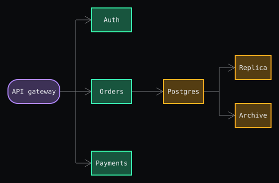
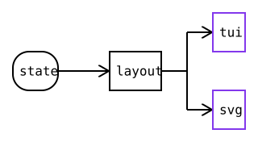

**dre** is a keyboard-driven diagram editor that runs in your terminal.
Build a tree of boxes with a few keystrokes, style them, and save it to a
`.dre` file — or export it to a crisp SVG.

## Requirements

- macOS (Apple Silicon or Intel) or Linux (x86_64 or arm64)
- a terminal with Kitty graphics support — WezTerm works, Terminal.app doesn't

## Install

```
curl -fsSL https://raw.githubusercontent.com/slickroot/dre/main/install.sh | bash
```

## Getting started

Run `dre` to open an empty canvas. `dre plans.dre` opens `plans.dre`, or
starts a new diagram under that name if the file doesn't exist.

`dre` has three modes: command mode (the default), insert mode, and a save
prompt. In command mode, every key runs a command (see the table below);
`i` edits the selected box's label and `I` renames it, which enters insert
mode.

To quit, press `q`. With a filename, `q` saves to that file and quits. Without
a filename, `q` asks "Save as:" — pre-filled with `diagram.dre` — and `Enter`
saves, `Esc` quits without saving. `Ctrl-C` quits without saving.

## Example

`docs/example.dre` shows off rounded corners, border colours, translucent
fills, and arrows:

```xml
<dre>
  <box label="API gateway" colour="2" fill="1" rounded="true">
    <box label="Auth" colour="1" fill="1"/>
    <box label="Orders" colour="1" fill="1">
      <box label="Postgres" colour="4" fill="1">
        <box label="Replica" colour="4" fill="1"/>
        <box label="Archive" colour="4" fill="1"/>
      </box>
    </box>
    <box label="Payments" colour="1" fill="1"/>
  </box>
</dre>
```

Each colour names a layer — pink the edge, orange the services, blue the
data — and the rounded corners mark the single entry point.

`dre --svg docs/example.dre` renders it as `docs/example.svg`:



## Export to SVG

`dre --svg diagram.dre` writes `diagram.svg` next to your `.dre` file and
exits — a crisp, vector copy with the same boxes, labels, colours, fills,
rounded corners, and arrows, but no cursor or selection.

## Command mode

<!-- keymap:start -->

| Key | Description |
| --- | --- |
| `u` | Undo the last change |
| `b` | Add a child box |
| `s` | Add a sibling box |
| `h` | Select the parent box |
| `l` | Select the first child box |
| `j` | Select the next sibling |
| `k` | Select the previous sibling |
| `i` | Edit the selected box's label |
| `I` | Rename the selected box's label |
| `c` | Cycle the box's colour |
| `C` | Cycle the colour of every sibling |
| `f` | Toggle the box's fill |
| `F` | Toggle the fill of every sibling |
| `r` | Toggle rounded corners |
| `q` | Save and quit (or choose where to save) |

<!-- keymap:end -->

## Insert mode

<!-- insert-keymap:start -->

| Key | Description |
| --- | --- |
| `Enter` | Finish the box and add a child box |
| `Esc` | Switch to command mode |
| `Backspace` | Remove the last character |

<!-- insert-keymap:end -->

Any printable character appends to the label.

## Other keys

Save prompt: `Enter` saves and quits, `Esc` quits without saving, `Backspace`
removes a character from the filename.

`Ctrl-C` quits without saving.

## How dre is built

An arrow means the box on its left feeds the box on its right. The figure is
itself a dre diagram — `docs/architecture.dre`:

```xml
<dre>
  <box label="state" rounded="true">
    <box label="layout">
      <box label="tui" colour="3"/>
      <box label="svg" colour="3"/>
    </box>
  </box>
</dre>
```

`state` holds the tree of boxes and is where everything starts. `layout` turns
that tree into placements, and two renderers draw the same placements in their
own way: `tui` (`src/render.rs`) paints sprites in the editor, and `svg`
(`src/svg.rs`) writes `<rect>`s and `<text>`s. Purple marks the renderers.

