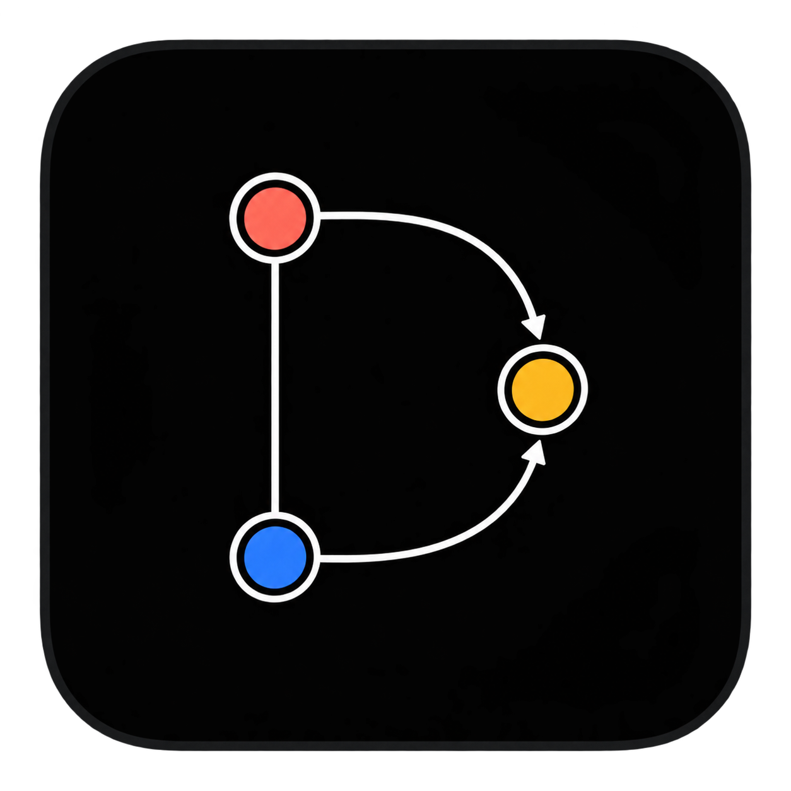
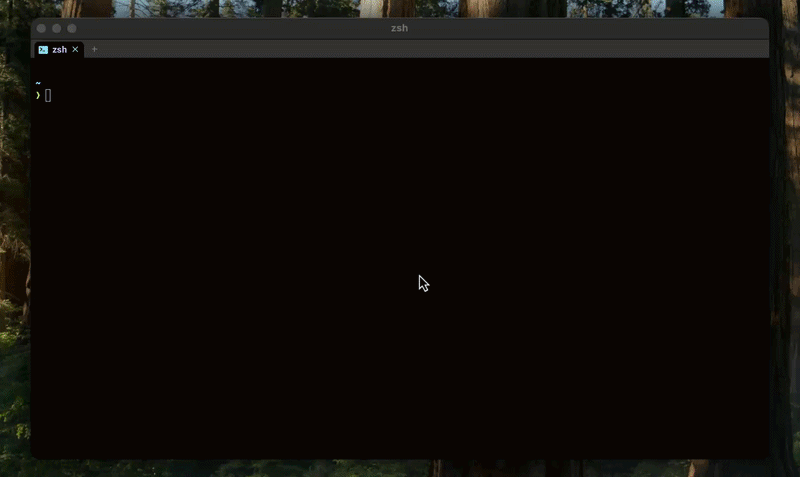
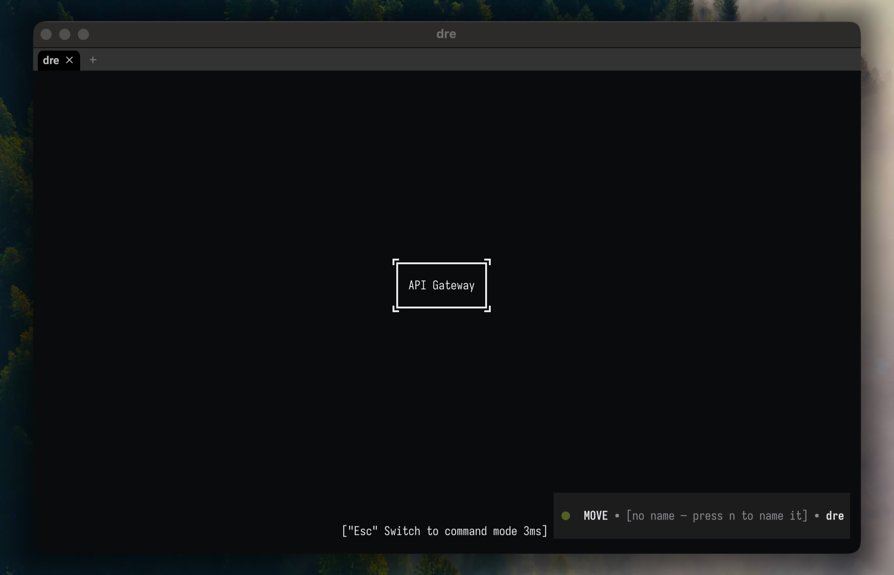
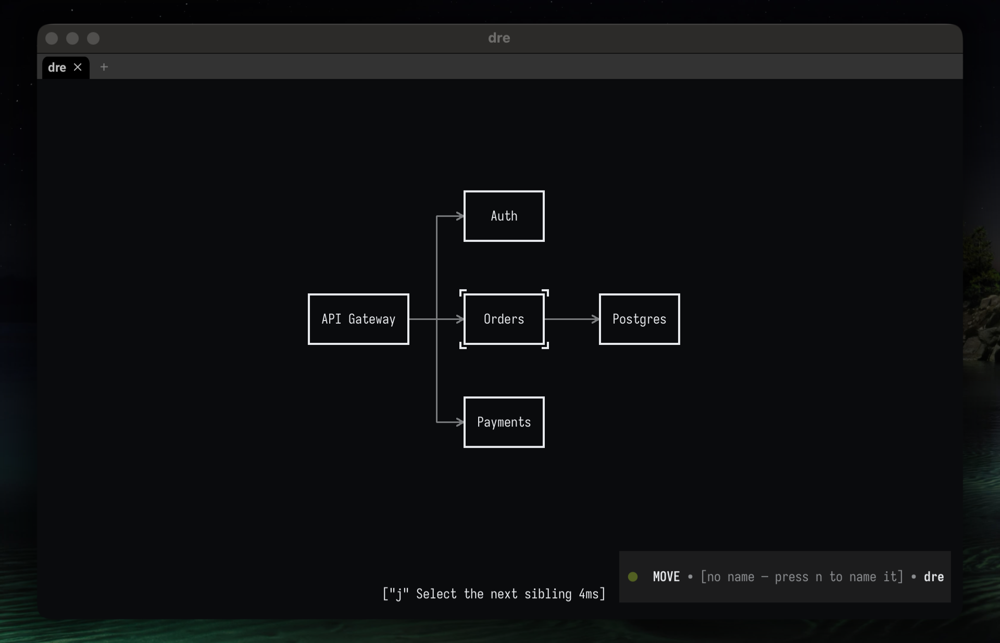
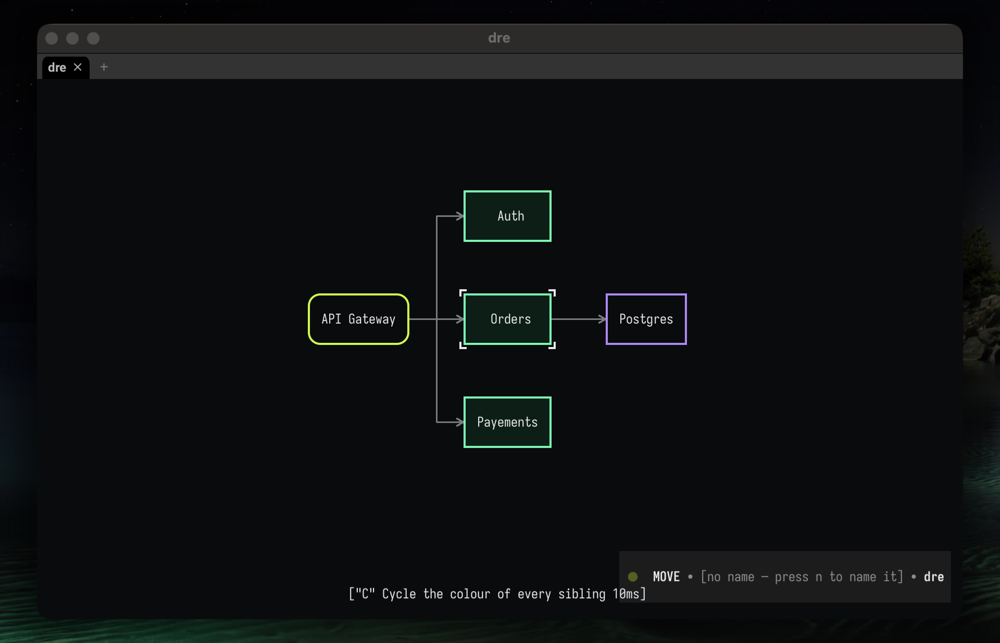
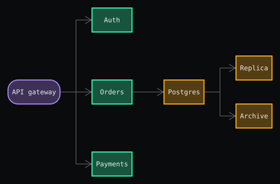
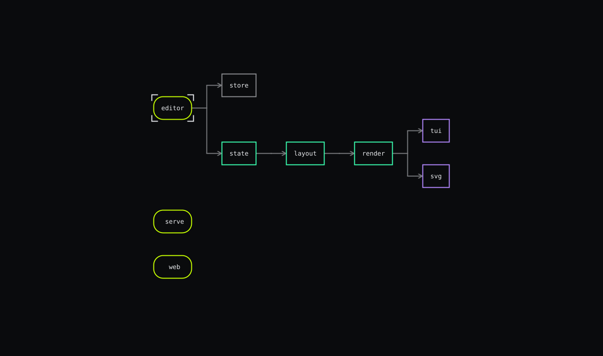

<!-- LOGO -->
<h1 align="center">
  
  <br>
  dre
</h1>

<p align="center">
  Keyboard-driven diagrams, directly in your terminal.
  <br>
  Build with a few keystrokes. Save as <code>.dre</code>. Export crisp SVG.
  <br>
  <a href="#install">Install</a>
  ·
  <a href="#getting-started">Getting started</a>
  ·
  <a href="#command-mode">Keymap</a>
  ·
  <a href="CONTRIBUTING.md">Contributing</a>
</p>

<p align="center">
  
</p>

## Try it without installing

```
ssh dre.elaich.com
```

Visitors get their own canvas, remembered between sessions.

## About

**dre** is a keyboard-driven diagram editor that runs in your terminal. Build
a tree of boxes, style it as you work, and keep it in a compact `.dre` file—or
export it to a crisp SVG when it is ready to share.

## Requirements

- macOS (Apple Silicon or Intel) or Linux (x86_64 or arm64)
- a terminal with Kitty graphics support — WezTerm works, Terminal.app doesn't

## Install

```
curl -fsSL https://dre.elaich.com/install.sh | bash
```

## Getting started

Run `dre` to open an empty canvas. `dre plans.dre` opens `plans.dre`, or
starts a new diagram under that name if the file doesn't exist.

<p align="center">
  
</p>

`dre` has three modes: command mode (the default), insert mode, and a save
prompt. In command mode, every key runs a command (see the table below);
`i` edits the selected box's label and `I` renames it, which enters insert
mode.

<p align="center">
  
</p>

<p align="center">
  
</p>

To quit, press `q`. With a filename, `q` saves to that file and quits. Without
a filename, `q` asks for one, and `Enter` saves and quits, `Esc` quits
without saving. `Ctrl-C` quits without saving.

## Command mode

<!-- keymap:start -->

| Mode | Key | Description |
| --- | --- | --- |
| Command | `u` | Undo the last change |
| Command | `b` | Add a child box |
| Command | `s` | Add a sibling box |
| Command | `d` | Delete the selected box and its descendants |
| Command | `p` | Paste the cut box and its descendants as the last child of the selected box |
| Command | `h` | Select the parent box |
| Command | `l` | Select the first child box |
| Command | `j` | Select the next sibling |
| Command | `k` | Select the previous sibling |
| Command | `i` | Edit the selected box's label |
| Command | `I` | Rename the selected box's label |
| Command | `c` | Cycle the box's colour |
| Command | `C` | Cycle the colour of every sibling |
| Command | `F` | Toggle the fill of every sibling |
| Command | `f` | Toggle the box's fill |
| Command | `r` | Toggle rounded corners |
| Command | `R` | Toggle rounded corners of every sibling |
| Command | `q` | Save and quit (or choose where to save) |
| Command | `n` | Name the diagram |
| Command | `0–9` | Build a count prefix |
| Command | `Ctrl-C` | Quit without saving |
| Insert | `Enter` | Finish the box and add a child box |
| Insert | `Esc` | Switch to command mode |
| Insert | `Backspace` | Remove the last character |
| Insert | `←` | Move the cursor left |
| Insert | `→` | Move the cursor right |
| Insert | `Printable` | Append a printable character |
| Name prompt | `Enter` | Save the name |
| Name prompt | `Esc` | Cancel naming |
| Name prompt | `Backspace` | Remove a character from the name |
| Name prompt | `Printable` | Append a character to the name |

<!-- keymap:end -->

Any printable character appends to the label.

Save prompt: `Enter` saves and quits, `Esc` quits without saving, `Backspace`
removes a character from the name.

`Ctrl-C` quits without saving.

## Files and export

A diagram is saved as a `.dre` file, plain XML that nests boxes the way the
diagram does. `docs/example.dre` shows off rounded corners, border colours,
translucent fills, and arrows:

```xml
<dre>
  <box label="API gateway" colour="2" fill="1" rounded="true">
    <box label="Auth" colour="1" fill="1"/>
    <box label="Orders" colour="1" fill="1">
      <box label="Postgres" colour="4" fill="1">
        <box label="Replica" colour="4" fill="1"/>
        <box label="Archive" colour="4" fill="1"/>
      </box>
    </box>
    <box label="Payments" colour="1" fill="1"/>
  </box>
</dre>
```

Each colour names a layer — pink the edge, orange the services, blue the
data — and the rounded corners mark the single entry point.

`dre --svg docs/example.dre` writes `docs/example.svg` next to it and exits — a
crisp, vector copy with no cursor or selection:



## How dre is built

An arrow means the box on its left feeds the box on its right. The figure is
itself a dre diagram — `docs/architecture.dre`:

```xml
<dre>
  <box label="editor" colour="0" rounded="true">
    <box label="store" colour="7"/>
    <box label="state" colour="1">
      <box label="layout" colour="1">
        <box label="render" colour="1">
          <box label="tui" colour="2"/>
          <box label="svg" colour="2"/>
        </box>
      </box>
    </box>
  </box>
  <box label="serve" colour="0" rounded="true"/>
  <box label="web" colour="0" rounded="true"/>
</dre>
```

Three entry points share one core: `editor` is the terminal app, `serve` hosts
it over SSH and `web` runs it in the browser as wasm. A tree of boxes only has
arrows from parent to child, so the figure draws the core under `editor`;
`serve` and `web` sit beside it and drive the same core. `store` reads and
writes the `.dre` files for `editor`. In the core, `state` holds the tree of
boxes, `layout` turns it into placements and `render` hands those placements to
two renderers: `tui` (`src/render/terminal.rs`) paints sprites in the terminal
and `svg` (`src/render/svg.rs`) writes `<rect>`s and `<text>`s. Colour marks
the layers: lime for entry points, mint for the core, violet for the renderers.
`store` is grey.



See [CONTRIBUTING.md](CONTRIBUTING.md) to contribute.
